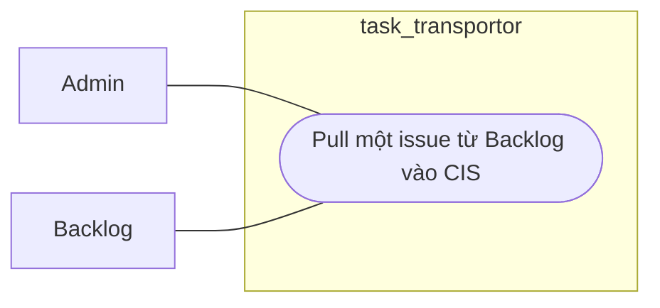

# Workflow - Backlog Manual Pull

## Mục tiêu

Kéo một issue cụ thể từ Backlog vào CIS theo action chủ động của admin hoặc API.

## Use case context

- Tên use case: `Pull một issue từ Backlog vào CIS`
- Actor chính: `Admin`
- Actor ngoài hệ thống: `Backlog`
- Tiền điều kiện: project đã có config Backlog hợp lệ
- Thành công khi: issue nguồn được ingest vào CIS và sẵn sàng cho các bước downstream

## Biểu đồ use case



## Trigger hiện tại

```text
POST /api/v1/projects/:projectId/backlog/issues/:backlogIssueKey/pull
```

## Luồng chính

Biểu đồ dưới đây là workflow kỹ thuật, không phải use case nghiệp vụ:

```text
Backlog controller
  -> BacklogApi
    -> backlog manual pull use case
      -> BacklogClient fetch full issue
      -> Backlog normalizer
      -> CisApi upsert issue, comment, attachment metadata
      -> SyncApi hoặc journal path hiện tại
```

## Ownership

- `Backlog` sở hữu fetch và normalize dữ liệu nguồn.
- `Cis` sở hữu canonical issue state và source snapshot sau ingest.
- `Sync` sở hữu job hoặc journal state khi workflow đi qua worker.

## Quy tắc

- `direction_from = backlog`, `direction_to = cis`.
- Không tạo đường tắt `Backlog -> Jira`.
- Translation không chạy trong inbound path này.
- Nếu có attachment file thật từ Backlog, worker có thể tải inline về CIS storage.

## Kết quả mong đợi

- Issue xuất hiện hoặc được cập nhật trong CIS.
- Comment và attachment metadata được materialize theo snapshot nguồn.
- Journal hoặc audit phản ánh lần pull này.
