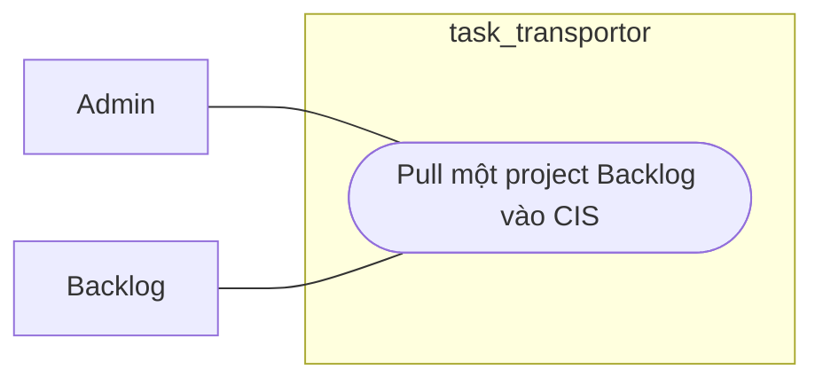

# Workflow - Backlog Project Pull

## Mục tiêu

Quét một project Backlog để tìm issue candidate và enqueue ingest theo phạm vi project.

## Use case context

- Tên use case: `Pull một project Backlog vào CIS`
- Actor chính: `Admin`
- Actor ngoài hệ thống: `Backlog`
- Tiền điều kiện: project tồn tại, có config pull hợp lệ
- Thành công khi: hệ thống tạo candidate ingest cho phạm vi project

## Biểu đồ use case



## Trigger hiện tại

```text
POST /api/v1/projects/:projectId/backlog/pull
```

## Luồng chính

Biểu đồ dưới đây là workflow kỹ thuật, không phải use case nghiệp vụ:

```text
Backlog controller
  -> BacklogApi
    -> project pull use case
      -> load project config
      -> query Backlog issue list
      -> apply filter project-level
      -> enqueue issue hoặc page candidates
```

## Ownership

- `Projects` sở hữu project config dùng cho pull.
- `Backlog` sở hữu query danh sách issue và lọc theo input nguồn.
- `Sync` sở hữu queue nội bộ của các candidate được tạo ra.
- `Cis` chỉ nhận ingest khi worker xử lý từng candidate.

## Quy tắc

- Đây là workflow inbound theo project, không sync trực tiếp sang Jira.
- Dùng cùng normalizer path với manual pull issue.
- Có thể dùng overlap window và filter JSON theo config project.

## Kết quả mong đợi

- Candidate đúng project được enqueue.
- Không ghi tắt vào CIS hoặc Jira từ controller layer.
- Worker downstream có đủ context để ingest từng issue.
