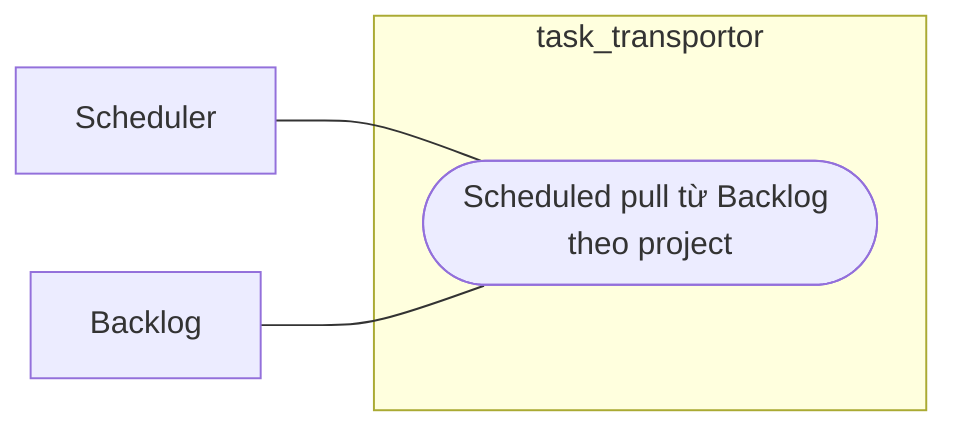

# Workflow - Backlog Scheduled Pull

## Mục tiêu

Tự động quét Backlog theo lịch dựa trên project config và `pull_state`.

## Use case context

- Tên use case: `Scheduled pull từ Backlog theo project`
- Actor chính: `Scheduler`
- Actor ngoài hệ thống: `Backlog`
- Tiền điều kiện: project bật scheduled pull và đủ điều kiện chạy
- Thành công khi: candidate ingest được tạo tự động mà không cần admin thao tác tay

## Biểu đồ use case



## Trigger hiện tại

```text
scheduler nội bộ -> backlog scheduled pull scanner
```

## Luồng chính

Biểu đồ dưới đây là workflow kỹ thuật, không phải use case nghiệp vụ:

```text
scheduler
  -> load enabled projects
  -> check scheduled pull config
  -> compute updated_since với overlap window
  -> query Backlog issue list
  -> apply scheduled filter
  -> enqueue issue candidates
  -> update pull_state
```

## Ownership

- `Projects` sở hữu config scheduled pull.
- `Backlog` sở hữu query source list và filter theo source semantics.
- `Sync` sở hữu candidate jobs.
- `Cis` chỉ bị mutate khi ingest worker chạy từng issue.

## Quy tắc

- Scheduled pull là trigger tự động thay cho webhook ở Lite.
- Dùng lại cùng normalizer và ingest path với manual pull.
- Không tạo translation hoặc outbound sync trực tiếp trong workflow này.

## Kết quả mong đợi

- Chỉ project đủ điều kiện mới được quét.
- `pull_state` được cập nhật sau lần quét thành công.
- Duplicate pull không làm phình state không cần thiết.
