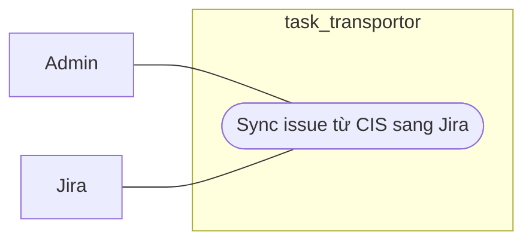

# Workflow - CIS To Jira Sync

## Mục tiêu

Đẩy issue từ CIS sang Jira sau khi đã pass dry-run và pre-check.

## Use case context

- Tên use case: `Sync issue từ CIS sang Jira`
- Actor chính: `Admin`
- Actor ngoài hệ thống: `Jira`
- Tiền điều kiện: dry-run còn mới và pre-check đã pass
- Thành công khi: issue được create hoặc update trên Jira và CIS ghi nhận kết quả sync

## Biểu đồ use case



## Trigger hiện tại

```text
POST /api/v1/issues/:issueId/sync/jira
sync_jobs job_type = push_issue
```

## Luồng chính

Biểu đồ dưới đây là workflow kỹ thuật, không phải use case nghiệp vụ:

```text
Jira sync use case hoặc worker
  -> validate dry-run freshness
  -> validate mapping, anomaly, config
  -> JiraClient create hoặc update
  -> CisApi.saveIssueJiraSyncResult(...)
  -> SyncApi update job và journal
```

## Ownership

- `Jira` sở hữu create/update call ra Jira và outbound orchestration.
- `Cis` sở hữu update `jira_issue_key`, `sync_status`, `last_synced_at` hoặc state tương đương.
- `Sync` sở hữu job state và `sync_journal`.

## Quy tắc

- Không gọi Jira API nếu pre-check fail.
- `Jira` không tự `UPDATE issues`.
- Mỗi attempt phải có journal hoặc audit đủ để retry hay recover.

## Kết quả mong đợi

- Jira issue được create hoặc update đúng contract.
- CIS phản ánh kết quả sync qua owner path.
- Retry hoặc fail state rõ ràng trong `sync_jobs` và `sync_journal`.
