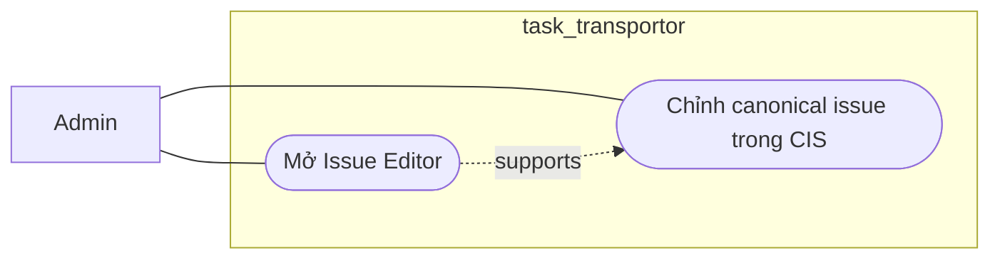

# Workflow - Issue Editor Canonical Edit

## Mục tiêu

Cho admin chỉnh canonical issue data trong CIS mà không ghi đè snapshot nguồn.

## Use case context

- Tên use case: `Chỉnh canonical issue trong CIS`
- Actor chính: `Admin`
- Tiền điều kiện: issue đã tồn tại trong CIS
- Thành công khi: canonical branch được cập nhật, revision hoặc audit tương ứng được ghi lại

## Biểu đồ use case



## Trigger hiện tại

```text
GET /api/v1/issues/:issueId/editor
PATCH /api/v1/issues/:issueId
```

## Luồng chính

Biểu đồ dưới đây là workflow kỹ thuật, không phải use case nghiệp vụ:

```text
Cis controller
  -> CisApi
    -> load issue editor view
    -> update fields_json.*.cis
    -> create revision nếu cần
    -> write audit hoặc journal
```

## Ownership

- `Cis` sở hữu canonical branch `fields_json.*.cis`.
- Snapshot nguồn `backlog` và `jira` không bị mutate bởi manual edit này.
- Các module khác chỉ đọc hoặc phản ứng qua contract công khai.

## Quy tắc

- Canonical edit chỉ ghi vào nhánh `cis`.
- Nếu thay đổi ảnh hưởng outbound payload, dry-run cũ phải stale.
- Workflow này không bypass mapping, anomaly hoặc Jira dry-run.

## Kết quả mong đợi

- Admin có thể chuẩn hóa dữ liệu issue trong CIS.
- Revision mới được tạo khi cần trace history.
- Sync path sau đó dùng canonical effective values mới nhất.
