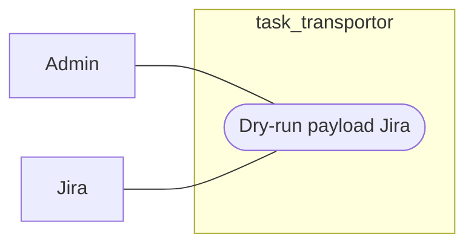

# Workflow - Jira Dry-Run

## Mục tiêu

Build payload preview cho Jira và validate điều kiện sync trước khi gọi Jira API thật.

## Use case context

- Tên use case: `Dry-run payload Jira`
- Actor chính: `Admin`
- Actor ngoài hệ thống: `Jira`
- Tiền điều kiện: issue đã có dữ liệu canonical tối thiểu để build payload
- Thành công khi: admin thấy preview payload và biết issue có sync được hay không

## Biểu đồ use case



## Trigger hiện tại

```text
POST /api/v1/issues/:issueId/dry-run/jira
```

## Luồng chính

Biểu đồ dưới đây là workflow kỹ thuật, không phải use case nghiệp vụ:

```text
Jira controller
  -> JiraApi
    -> read outbound snapshot
    -> MappingApi
    -> AnomalyApi hoặc pre-check
    -> build Jira payload
    -> return preview, warnings, validation
```

## Ownership

- `Jira` sở hữu payload builder và contract preview outbound.
- `Mapping` sở hữu mapping rule được duyệt.
- `Anomaly` sở hữu blocking health state.
- `Cis` vẫn là owner của canonical source data dùng để build payload.

## Quy tắc

- Dry-run không gọi Jira API thật.
- Payload lấy từ canonical effective values.
- Gate hiện tại gồm mapping, anomaly, Jira config, sync state và stale dry-run.

## Kết quả mong đợi

- Trả payload preview và `can_sync`.
- Phát hiện missing mapping, stale dry-run hoặc anomaly block trước sync thật.
- Không mutate state outbound như một side effect chính của preview.
