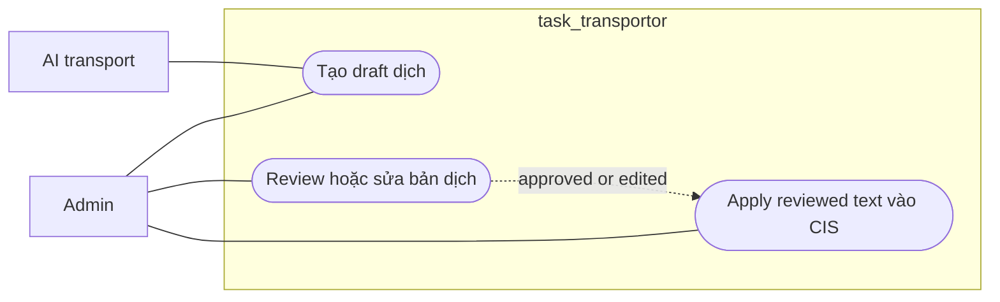

# Workflow - Translation Review

## Mục tiêu

Tạo draft dịch cho issue field, sau đó review, approve, reject hoặc manual edit trước khi apply vào canonical issue.

## Use case context

- Use case 1: `Tạo draft dịch`
- Use case 2: `Review hoặc sửa bản dịch`
- Actor chính: `Admin`
- Actor ngoài hệ thống: `AI transport`
- Tiền điều kiện: issue và target field đã có source text phù hợp
- Thành công khi: queue item có reviewed outcome và reviewed text có thể được apply vào CIS

## Biểu đồ use case



## Trigger hiện tại

```text
POST /api/v1/translations/issues/:issueId/translate
POST /api/v1/translations/issues/:issueId/items/:queueId/translate
POST /api/v1/translation-queue/:queueId/approve
POST /api/v1/translation-queue/:queueId/reject
POST /api/v1/translation-queue/:queueId/retranslate
POST /api/v1/translation-queue/:queueId/manual-edit
```

## Luồng chính

Biểu đồ dưới đây là workflow kỹ thuật, không phải use case nghiệp vụ:

```text
Translation controller
  -> TranslationApi
    -> collect context
    -> TranslationAdapter
    -> write translation_queue draft
    -> audit

review action
  -> TranslationApi
  -> CisApi.applyReviewedIssueTranslation(...) nếu approve hoặc manual edit
```

## Ownership

- `Translation` sở hữu `translation_queue` và review lifecycle.
- `Cis` sở hữu canonical issue update sau khi reviewed text được apply.
- `src/infrastructure/ai` sở hữu transport AI hoặc process transport.

## Quy tắc

- `Translation` không tự `UPDATE issues`.
- Prompt, parse output, confidence và review state ở module `Translation`.
- URL, auth, timeout, protocol và process execution ở `src/infrastructure/ai`.
- Trong Issue Editor flow hiện tại, translate issue chạy ngay trong request nhưng vẫn lưu queue để giữ review hoặc audit.

## Kết quả mong đợi

- Queue item có draft hoặc reviewed state rõ ràng.
- Approve hoặc manual edit có thể cập nhật `fields_json.<target_field>.cis`.
- Reject không apply vào canonical issue.
