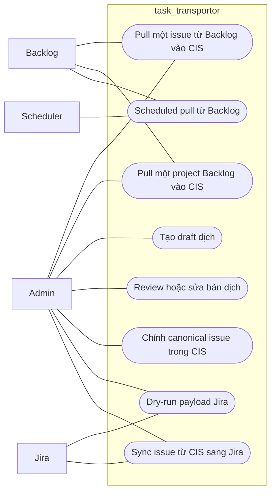

# Use Case Map

## Mục tiêu

Cho góc nhìn actor -> use case của `task_transportor` ở trạng thái hiện tại. File này không mô tả chi tiết các bước kỹ thuật; phần đó nằm ở từng workflow riêng.

## Actor chính

- `Admin`
- `Scheduler`
- `Backlog`
- `Jira`

## Biểu đồ use case

## Ghi chú

- `UC4` và `UC5` là hai use case khác nhau: tạo draft dịch và review bản dịch.
- `UC7` và `UC8` cũng tách riêng: dry-run không đồng nghĩa sync thật.
- Worker nội bộ tham gia ở lớp workflow kỹ thuật, không phải actor nghiệp vụ chính của use case map này.

## Mapping sang workflow files

- `Pull một issue từ Backlog vào CIS` -> [backlog-manual-pull.md](backlog-manual-pull.md)
- `Pull một project Backlog vào CIS` -> [backlog-project-pull.md](backlog-project-pull.md)
- `Scheduled pull từ Backlog` -> [backlog-scheduled-pull.md](backlog-scheduled-pull.md)
- `Tạo draft dịch` và `Review hoặc sửa bản dịch` -> [translation-review.md](translation-review.md)
- `Chỉnh canonical issue trong CIS` -> [issue-editor-canonical-edit.md](issue-editor-canonical-edit.md)
- `Dry-run payload Jira` -> [jira-dry-run.md](jira-dry-run.md)
- `Sync issue từ CIS sang Jira` -> [cis-to-jira-sync.md](cis-to-jira-sync.md)
