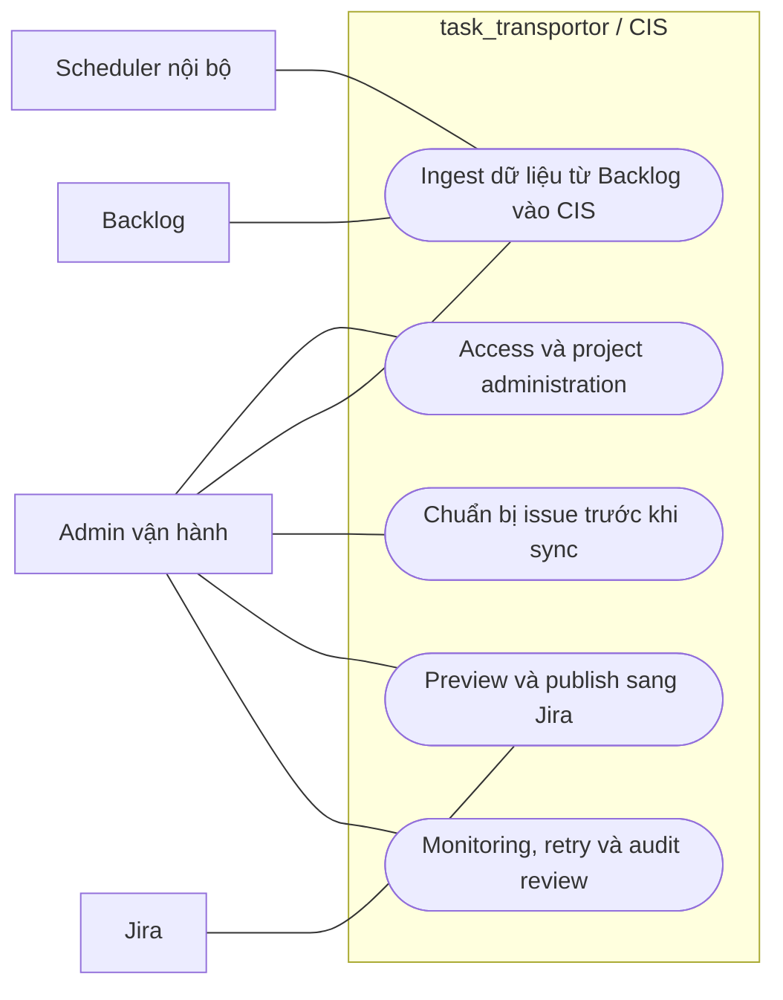

# Business Use Case Map

## Mục tiêu

Cho góc nhìn quản lý tổng thể về các nhóm use case chính của hệ thống.

## Biểu đồ use case

## Mapping sang usecase docs

- `Access và project administration` -> [access-and-project-admin.md](access-and-project-admin.md)
- `Ingest dữ liệu từ Backlog vào CIS` -> [ingest-from-backlog.md](ingest-from-backlog.md)
- `Chuẩn bị issue trước khi sync` -> [issue-preparation.md](issue-preparation.md)
- `Preview và publish sang Jira` -> [publish-to-jira.md](publish-to-jira.md)
- `Monitoring, retry và audit review` -> [monitor-and-recover.md](monitor-and-recover.md)
