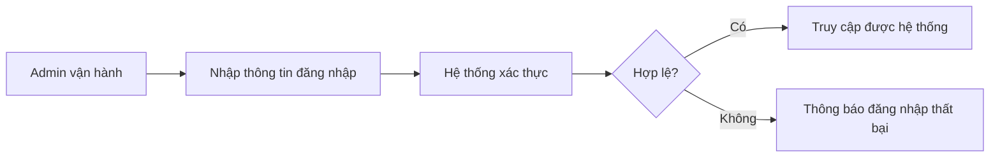

# Business Workflow - Đăng Nhập Quản Trị

## Mục tiêu nghiệp vụ

Cho phép người vận hành xác thực vào hệ thống để truy cập các màn hình và action quản trị.

## Use case

- Tên use case: `Đăng nhập quản trị`
- Mục tiêu: xác minh danh tính admin trước khi cho phép dùng các workflow vận hành
- Actor khởi tạo: `Admin vận hành`
- Kết quả thành công: admin có phiên hoặc token hợp lệ để truy cập hệ thống

## Actor

- Chính: `Admin vận hành`

## Khi nào dùng

- Bắt đầu ca vận hành.
- Trước khi truy cập dashboard, project config, issue editor hoặc sync action.

## Đầu vào nghiệp vụ

- Email và password hợp lệ.

## Kết quả nghiệp vụ

- Admin vào được hệ thống.
- Các action bảo vệ có thể được thực hiện trong phiên hợp lệ.

## Điều kiện hoàn tất

- Hệ thống xác thực thành công và trả phiên hoặc token hợp lệ.

## Ngoại lệ nghiệp vụ

- Sai thông tin đăng nhập.
- Phiên hết hạn và cần đăng nhập lại.

## Biểu đồ business workflow

