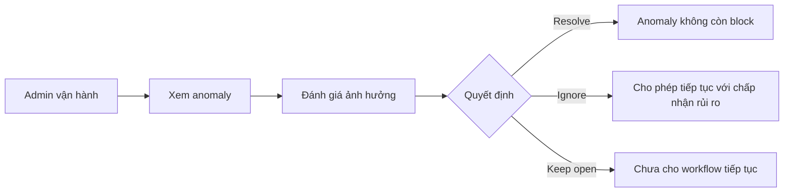

# Business Workflow - Xử Lý Anomaly

## Mục tiêu nghiệp vụ

Cho phép người vận hành xem các bất thường, đánh giá mức độ ảnh hưởng và quyết định ignore hoặc resolve trước khi tiếp tục sync.

## Use case

- Tên use case: `Xử lý anomaly`
- Mục tiêu: giữ an toàn vận hành khi hệ thống phát hiện tín hiệu bất thường
- Actor khởi tạo: `Admin vận hành`
- Kết quả thành công: anomaly có quyết định rõ ràng và không còn block không giải thích được

## Actor

- Chính: `Admin vận hành`

## Khi nào dùng

- Issue hoặc sync bị block bởi anomaly.
- Cần phân loại lỗi vận hành và tín hiệu warning.

## Đầu vào nghiệp vụ

- Một anomaly đang ở trạng thái open hoặc investigating.

## Kết quả nghiệp vụ

- Anomaly được ignore hoặc resolve có chủ đích.
- Workflow downstream biết có thể tiếp tục hay chưa.

## Điều kiện hoàn tất

- Trạng thái anomaly đổi sang trạng thái quyết định phù hợp.

## Ngoại lệ nghiệp vụ

- Ignore sai anomaly critical.
- Resolve thiếu căn cứ khiến lỗi lặp lại ở lần sync sau.

## Biểu đồ business workflow

