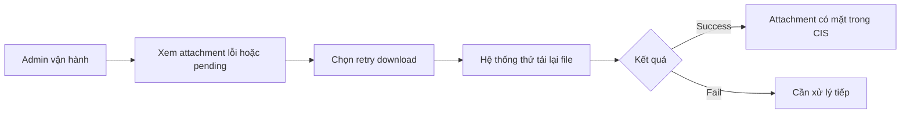

# Business Workflow - Retry Tải Attachment

## Mục tiêu nghiệp vụ

Cho phép người vận hành thử tải lại attachment bị lỗi hoặc còn pending mà không phải re-ingest toàn bộ issue.

## Use case

- Tên use case: `Retry tải attachment`
- Mục tiêu: khôi phục dữ liệu file còn thiếu trong CIS mà không ảnh hưởng toàn bộ issue
- Actor khởi tạo: `Admin vận hành`
- Kết quả thành công: attachment được tải thành công về CIS hoặc có trạng thái lỗi rõ hơn

## Actor

- Chính: `Admin vận hành`

## Khi nào dùng

- Attachment download fail.
- Attachment còn pending sau pull trước đó.

## Đầu vào nghiệp vụ

- Một attachment có trạng thái tải chưa hoàn tất.

## Kết quả nghiệp vụ

- Attachment được tải lại thành công.
- Nếu vẫn lỗi, người vận hành có thêm tín hiệu để xử lý tiếp.

## Điều kiện hoàn tất

- Trạng thái tải attachment được cập nhật sau lần retry.

## Ngoại lệ nghiệp vụ

- Nguồn không còn cung cấp file.
- Credential hoặc quyền truy cập file nguồn không hợp lệ.

## Biểu đồ business workflow

