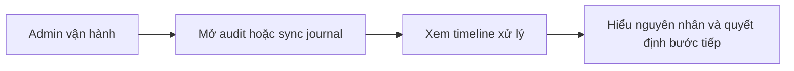

# Business Workflow - Xem Audit Và Sync Journal

## Mục tiêu nghiệp vụ

Cho phép người vận hành tra lại lịch sử thay đổi và các lần xử lý để hiểu chuyện gì đã xảy ra với issue hoặc job.

## Use case

- Tên use case: `Xem audit và sync journal`
- Mục tiêu: truy vết lịch sử vận hành để debug, xác minh và ra quyết định tiếp theo
- Actor khởi tạo: `Admin vận hành`
- Kết quả thành công: admin hiểu được timeline xử lý và biết bước kế tiếp nên làm gì

## Actor

- Chính: `Admin vận hành`

## Khi nào dùng

- Sau khi sync fail hoặc retry nhiều lần.
- Cần xác minh ai đã chỉnh canonical data hoặc approve review.
- Cần đối chiếu một issue đã đi qua những bước nào.

## Đầu vào nghiệp vụ

- Một issue, queue item hoặc job cần truy vết.

## Kết quả nghiệp vụ

- Admin thấy được timeline xử lý và trạng thái các lần chạy.
- Có đủ căn cứ để retry, resolve anomaly hoặc chỉnh dữ liệu tiếp.

## Điều kiện hoàn tất

- Lịch sử xử lý đủ rõ để trả lời câu hỏi vận hành hiện tại.

## Ngoại lệ nghiệp vụ

- Audit thiếu hoặc journal không đủ chi tiết làm khó truy vết.

## Biểu đồ business workflow

