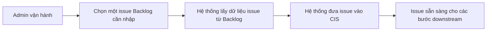

# Business Workflow - Đưa Một Issue Từ Backlog Vào CIS

## Mục tiêu nghiệp vụ

Đưa một issue cụ thể từ Backlog vào CIS để đội vận hành có thể xem, chuẩn hóa, dịch nếu cần và chuẩn bị sync sang Jira.

## Use case

- Tên use case: `Đưa một issue từ Backlog vào CIS`
- Mục tiêu: nhập một issue nguồn vào CIS để bắt đầu các bước vận hành downstream
- Actor khởi tạo: `Admin vận hành`
- Actor ngoài hệ thống: `Backlog`
- Kết quả thành công: issue đã có mặt trong CIS và sẵn sàng cho review hoặc sync preparation

## Actor

- Chính: `Admin vận hành`
- Ngoài hệ thống: `Backlog`

## Khi nào dùng

- Cần pull một issue cụ thể để xử lý ngay.
- Cần resync lại một issue sau khi dữ liệu nguồn đã đổi.
- Cần nhập một issue ban đầu trước khi làm các bước downstream.

## Đầu vào nghiệp vụ

- Project đã được cấu hình hợp lệ.
- Có khóa hoặc định danh issue trên Backlog.

## Kết quả nghiệp vụ

- Issue xuất hiện trong CIS.
- Comment và attachment metadata liên quan được đưa về CIS.
- Issue sẵn sàng cho translation review, canonical edit, dry-run và sync Jira.

## Điều kiện hoàn tất

- Người vận hành thấy issue đã có mặt trong CIS.
- Dữ liệu nguồn đủ để mở Issue Editor hoặc các màn downstream.

## Ngoại lệ nghiệp vụ

- Thiếu cấu hình project hoặc credential.
- Issue nguồn không tồn tại hoặc không đọc được.
- Attachment tải lỗi nhưng issue chính vẫn có thể vào CIS.

## Biểu đồ business workflow

