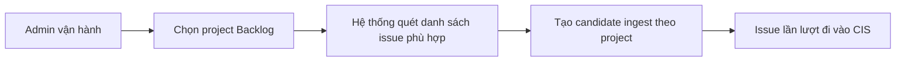

# Business Workflow - Đưa Một Project Backlog Vào CIS

## Mục tiêu nghiệp vụ

Cho phép người vận hành kéo một phạm vi issue theo project từ Backlog vào CIS thay vì xử lý từng issue đơn lẻ.

## Use case

- Tên use case: `Đưa một project Backlog vào CIS`
- Mục tiêu: tạo ingest candidate theo phạm vi project để giảm thao tác pull từng issue
- Actor khởi tạo: `Admin vận hành`
- Actor ngoài hệ thống: `Backlog`
- Kết quả thành công: project tạo ra danh sách candidate ingest hợp lệ cho CIS

## Actor

- Chính: `Admin vận hành`
- Ngoài hệ thống: `Backlog`

## Khi nào dùng

- Cần import dữ liệu ban đầu cho một project.
- Cần quét lại nhiều issue thuộc cùng project.
- Cần tạo candidate ingest hàng loạt theo filter business.

## Đầu vào nghiệp vụ

- Project đã tồn tại trong hệ thống.
- Pull config và filter project-level hợp lệ.

## Kết quả nghiệp vụ

- Hệ thống tạo danh sách candidate ingest cho project.
- Các issue phù hợp sẽ lần lượt đi vào CIS theo đường ingest chuẩn.

## Điều kiện hoàn tất

- Candidate đúng phạm vi project được tạo ra.
- Các issue downstream có thể được ingest mà không cần thao tác tay từng issue.

## Ngoại lệ nghiệp vụ

- Filter project không hợp lệ.
- Thiếu credential hoặc cấu hình nguồn.
- Khối lượng issue lớn khiến việc ingest kéo dài theo nhiều lượt xử lý.

## Biểu đồ business workflow

