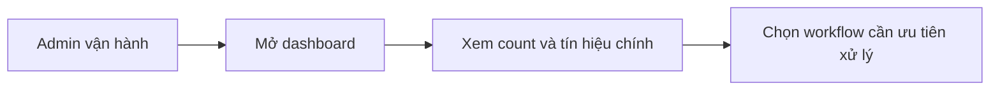

# Business Workflow - Theo Dõi Dashboard Vận Hành

## Mục tiêu nghiệp vụ

Cho phép đội vận hành nhìn nhanh tình trạng hệ thống để biết đang có queue pending, job lỗi, anomaly mở hay issue cần review hay không.

## Use case

- Tên use case: `Theo dõi dashboard vận hành`
- Mục tiêu: phát hiện sớm tình trạng bất thường và ưu tiên công việc vận hành
- Actor khởi tạo: `Admin vận hành`
- Kết quả thành công: admin có đủ bức tranh để quyết định workflow nào cần xử lý trước

## Actor

- Chính: `Admin vận hành`

## Khi nào dùng

- Bắt đầu ca vận hành.
- Sau khi có đợt pull hoặc sync lớn.
- Khi cần biết hệ thống đang nghẽn ở đâu.

## Đầu vào nghiệp vụ

- Dữ liệu trạng thái hiện tại của jobs, reviews, anomalies và issues.

## Kết quả nghiệp vụ

- Admin thấy các điểm nóng vận hành.
- Có thể đi tiếp vào issue, job hoặc anomaly cần xử lý.

## Điều kiện hoàn tất

- Dashboard phản ánh đủ các chỉ báo chính để ra quyết định.

## Ngoại lệ nghiệp vụ

- Dashboard thiếu số liệu hoặc số liệu cũ làm lệch ưu tiên xử lý.

## Biểu đồ business workflow

