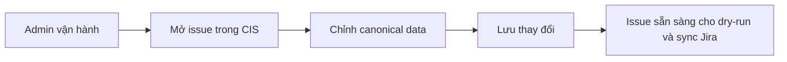

# Business Workflow - Chuẩn Hóa Issue Trong CIS Trước Khi Sync Jira

## Mục tiêu nghiệp vụ

Cho phép người vận hành chuẩn hóa dữ liệu issue trong CIS trước khi xem preview hoặc sync sang Jira.

## Use case

- Tên use case: `Chuẩn hóa issue trong CIS trước khi sync Jira`
- Mục tiêu: đưa issue về trạng thái canonical đủ rõ để downstream dùng nhất quán
- Actor khởi tạo: `Admin vận hành`
- Kết quả thành công: canonical issue đã được chỉnh và sẵn sàng cho dry-run hoặc sync

## Actor

- Chính: `Admin vận hành`

## Khi nào dùng

- Dữ liệu từ nguồn chưa đủ sạch hoặc chưa đúng ngữ nghĩa để sync.
- Cần chỉnh canonical summary, description hoặc field vận hành khác.
- Cần phản ánh quyết định review của đội vận hành vào CIS.

## Đầu vào nghiệp vụ

- Issue đã tồn tại trong CIS.
- Người vận hành xác định field nào cần chỉnh ở canonical branch.

## Kết quả nghiệp vụ

- Canonical issue được chuẩn hóa.
- Các bước downstream như dry-run và sync Jira dùng dữ liệu canonical mới nhất.

## Điều kiện hoàn tất

- Canonical branch được cập nhật thành công.
- Hệ thống ghi được revision hoặc audit tương ứng.

## Ngoại lệ nghiệp vụ

- Người vận hành chỉnh sai dữ liệu làm issue cần dry-run lại.
- Canonical thay đổi khiến kết quả dry-run cũ không còn dùng được.

## Biểu đồ business workflow

