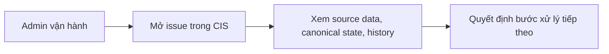

# Business Workflow - Mở Và Tra Cứu Issue Trong CIS

## Mục tiêu nghiệp vụ

Cho phép người vận hành mở một issue trong CIS để hiểu trạng thái hiện tại trước khi dịch, chỉnh canonical, dry-run hoặc sync.

## Use case

- Tên use case: `Mở và tra cứu issue trong CIS`
- Mục tiêu: tạo điểm vào chính cho mọi quyết định vận hành liên quan tới một issue
- Actor khởi tạo: `Admin vận hành`
- Kết quả thành công: admin hiểu được dữ liệu nguồn, canonical state, history và các block liên quan

## Actor

- Chính: `Admin vận hành`

## Khi nào dùng

- Vừa ingest xong một issue.
- Cần kiểm tra trước khi review translation hoặc sync Jira.
- Cần xem history, anomaly hoặc journal của issue.

## Đầu vào nghiệp vụ

- Một issue đã tồn tại trong CIS.

## Kết quả nghiệp vụ

- Admin thấy được issue theo ngữ cảnh vận hành.
- Có thể quyết định bước tiếp theo phù hợp.

## Điều kiện hoàn tất

- Issue mở được với đủ context cần thiết để hành động tiếp.

## Ngoại lệ nghiệp vụ

- Issue chưa tồn tại hoặc dữ liệu chưa ingest xong.
- Issue có trạng thái conflict hoặc block cần xử lý trước.

## Biểu đồ business workflow

