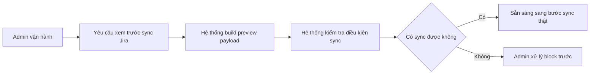

# Business Workflow - Xem Trước Sync Jira

## Mục tiêu nghiệp vụ

Cho người vận hành xem trước payload Jira và biết issue đã đủ điều kiện sync hay chưa trước khi ghi dữ liệu thật sang Jira.

## Use case

- Tên use case: `Xem trước sync Jira`
- Mục tiêu: giúp người vận hành quyết định có thể sync thật hay còn bị block
- Actor khởi tạo: `Admin vận hành`
- Actor ngoài hệ thống: `Jira`
- Kết quả thành công: có preview payload và trạng thái `can_sync` hoặc lý do block

## Actor

- Chính: `Admin vận hành`
- Ngoài hệ thống: `Jira`

## Khi nào dùng

- Trước khi sync issue sang Jira.
- Sau khi issue vừa được chỉnh canonical hoặc mapping vừa đổi.

## Đầu vào nghiệp vụ

- Issue đã có dữ liệu canonical.
- Mapping, anomaly và cấu hình Jira liên quan có thể được kiểm tra.

## Kết quả nghiệp vụ

- Có preview payload Jira.
- Người vận hành biết `can_sync` hoặc các lý do đang bị block.

## Điều kiện hoàn tất

- Preview được hiển thị đầy đủ.
- Hệ thống trả được warning, error hoặc điều kiện cho bước sync thật.

## Ngoại lệ nghiệp vụ

- Thiếu mapping required.
- Có anomaly đang block.
- Dry-run stale hoặc config Jira chưa đủ.

## Biểu đồ business workflow

