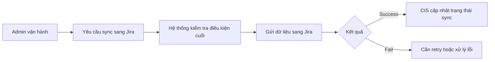

# Business Workflow - Sync Issue Sang Jira

## Mục tiêu nghiệp vụ

Đưa issue đã chuẩn bị trong CIS sang Jira bằng create hoặc update thật.

## Use case

- Tên use case: `Sync issue sang Jira`
- Mục tiêu: publish dữ liệu đã chuẩn bị trong CIS sang Jira
- Actor khởi tạo: `Admin vận hành`
- Actor ngoài hệ thống: `Jira`
- Kết quả thành công: Jira nhận issue thành công và CIS ghi nhận trạng thái sync mới

## Actor

- Chính: `Admin vận hành`
- Ngoài hệ thống: `Jira`

## Khi nào dùng

- Issue đã pass dry-run và đủ điều kiện sync.
- Người vận hành quyết định đẩy dữ liệu sang Jira.

## Đầu vào nghiệp vụ

- Dry-run còn mới và hợp lệ.
- Mapping, anomaly, config và sync state đều cho phép sync.

## Kết quả nghiệp vụ

- Issue trên Jira được create hoặc update.
- CIS ghi nhận trạng thái sync mới nhất.

## Điều kiện hoàn tất

- Jira nhận dữ liệu thành công.
- CIS lưu được kết quả sync, trạng thái và audit liên quan.

## Ngoại lệ nghiệp vụ

- Dry-run cũ đã stale.
- Jira trả lỗi hoặc từ chối request.
- Sync fail sau khi gọi Jira và cần retry hoặc manual recover.

## Biểu đồ business workflow

