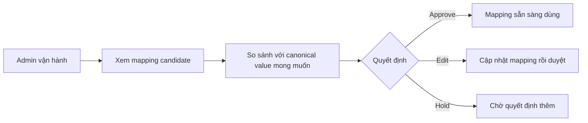

# Business Workflow - Review Và Approve Mapping

## Mục tiêu nghiệp vụ

Cho phép người vận hành xác nhận mapping giữa dữ liệu hệ thống nguồn, canonical CIS và hệ thống đích trước khi sync thật.

## Use case

- Tên use case: `Review và approve mapping`
- Mục tiêu: ngăn sync sai do thiếu hoặc sai rule mapping
- Actor khởi tạo: `Admin vận hành`
- Kết quả thành công: mapping được approve và sẵn sàng cho dry-run hoặc sync

## Actor

- Chính: `Admin vận hành`

## Khi nào dùng

- Có mapping mới cần duyệt.
- Dry-run bị block vì missing mapping.
- Mapping cũ cần chỉnh theo thực tế vận hành.

## Đầu vào nghiệp vụ

- Một hoặc nhiều mapping candidate.
- Ngữ cảnh field hoặc value đang cần map.

## Kết quả nghiệp vụ

- Mapping được approve, chỉnh hoặc giữ ở trạng thái chờ.
- Dry-run hoặc sync downstream có thể dùng rule đã duyệt.

## Điều kiện hoàn tất

- Mapping target có trạng thái rõ ràng và có thể dùng cho vận hành.

## Ngoại lệ nghiệp vụ

- Mapping còn mơ hồ và chưa đủ tin cậy để duyệt.
- Mapping duyệt sai có thể làm payload Jira bị sai ngữ nghĩa.

## Biểu đồ business workflow

