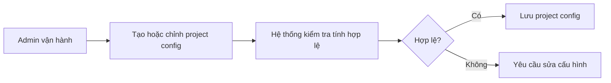

# Business Workflow - Tạo Hoặc Chỉnh Project Config

## Mục tiêu nghiệp vụ

Cho phép đội vận hành thiết lập project để hệ thống biết lấy dữ liệu từ đâu và đẩy dữ liệu đi đâu.

## Use case

- Tên use case: `Tạo hoặc chỉnh project config`
- Mục tiêu: duy trì cấu hình vận hành hợp lệ cho từng project
- Actor khởi tạo: `Admin vận hành`
- Kết quả thành công: project có cấu hình đủ cho pull, translation và sync

## Actor

- Chính: `Admin vận hành`

## Khi nào dùng

- Tạo project mới.
- Đổi thông tin nguồn hoặc đích tích hợp.
- Chỉnh filter pull, glossary hoặc cấu hình sync.

## Đầu vào nghiệp vụ

- Thông tin project.
- Cấu hình Backlog, Jira, translation và filter liên quan.

## Kết quả nghiệp vụ

- Project được lưu hợp lệ.
- Các workflow theo project có thể chạy theo cấu hình mới.

## Điều kiện hoàn tất

- Project config được lưu và đọc lại đúng.

## Ngoại lệ nghiệp vụ

- Thiếu field bắt buộc.
- Cấu hình nguồn hoặc đích không hợp lệ.

## Biểu đồ business workflow

