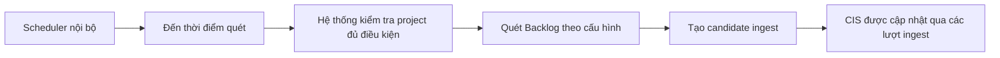

# Business Workflow - Tự Động Quét Backlog Theo Lịch

## Mục tiêu nghiệp vụ

Giảm thao tác tay bằng cách để hệ thống tự quét Backlog theo lịch và tạo ingest candidate cho các issue mới hoặc thay đổi.

## Use case

- Tên use case: `Tự động quét Backlog theo lịch`
- Mục tiêu: duy trì cập nhật CIS định kỳ mà không cần admin chủ động pull liên tục
- Actor khởi tạo: `Scheduler nội bộ`
- Actor ngoài hệ thống: `Backlog`
- Kết quả thành công: candidate ingest được tạo đều đặn theo cấu hình project

## Actor

- Chính: `Scheduler nội bộ`
- Ngoài hệ thống: `Backlog`

## Khi nào dùng

- Muốn duy trì cập nhật định kỳ mà không cần admin bấm pull liên tục.
- Dùng như bước trung gian thay cho webhook trong giai đoạn Lite.

## Đầu vào nghiệp vụ

- Project bật scheduled pull.
- Cấu hình khoảng quét và filter hợp lệ.

## Kết quả nghiệp vụ

- Hệ thống tự tạo candidate ingest cho các issue phù hợp.
- CIS dần được cập nhật theo nhịp quét định kỳ.

## Điều kiện hoàn tất

- Lần quét chạy xong và cập nhật trạng thái pull gần nhất.
- Candidate phù hợp được đưa vào hàng đợi nội bộ.

## Ngoại lệ nghiệp vụ

- Project chưa bật scheduled pull.
- Cấu hình quét không hợp lệ.
- Lỗi nguồn hoặc rate limit từ Backlog.

## Biểu đồ business workflow

