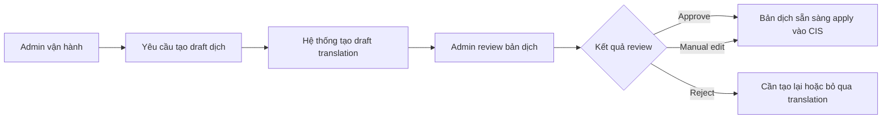

# Business Workflow - Tạo Và Review Bản Dịch

## Mục tiêu nghiệp vụ

Tạo bản dịch nháp cho nội dung issue và cho phép người vận hành review trước khi dùng bản dịch đó trong quá trình vận hành.

## Use case

- Use case 1: `Tạo draft dịch`
- Use case 2: `Review hoặc sửa bản dịch`
- Mục tiêu: tạo reviewed translation đủ tin cậy để dùng cho vận hành hoặc apply vào canonical issue
- Actor khởi tạo: `Admin vận hành`
- Actor ngoài hệ thống: `AI transport`
- Kết quả thành công: bản dịch có outcome rõ ràng như approve, manual edit hoặc reject

## Actor

- Chính: `Admin vận hành`
- Ngoài hệ thống: `AI transport`

## Khi nào dùng

- Issue có nội dung nguồn cần dịch trước khi đội vận hành xử lý tiếp.
- Cần chuẩn hóa bản dịch trước khi apply vào canonical issue.

## Đầu vào nghiệp vụ

- Issue đã có source text phù hợp.
- Project cho phép dùng translation workflow.

## Kết quả nghiệp vụ

- Có draft translation để review.
- Bản dịch được approve, reject hoặc manual edit.
- Reviewed text có thể trở thành input cho canonical issue.

## Điều kiện hoàn tất

- Queue item có trạng thái reviewed rõ ràng.
- Nếu approve hoặc manual edit, nội dung đã sẵn sàng để apply vào CIS.

## Ngoại lệ nghiệp vụ

- Source text trống hoặc không hợp lệ.
- AI trả bản dịch lỗi hoặc khó dùng.
- Bản dịch bị reject và chưa đủ điều kiện dùng downstream.

## Biểu đồ business workflow

