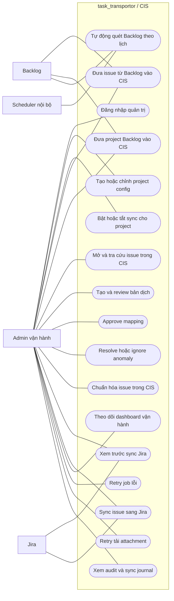

# Business Use Case Map

## Mục tiêu

Cho góc nhìn business-level về các use case chính của hệ thống hiện tại.

## Actor chính

- `Admin vận hành`
- `Scheduler nội bộ`
- `Backlog`
- `Jira`

## Biểu đồ use case

## Mapping sang business workflows

- `Đăng nhập quản trị` -> [admin-login.md](admin-login.md)
- `Tạo hoặc chỉnh project config` -> [project-configuration.md](project-configuration.md)
- `Bật hoặc tắt sync cho project` -> [project-sync-control.md](project-sync-control.md)
- `Đưa issue từ Backlog vào CIS` -> [backlog-one-issue-ingest.md](backlog-one-issue-ingest.md)
- `Đưa project Backlog vào CIS` -> [backlog-project-ingest.md](backlog-project-ingest.md)
- `Tự động quét Backlog theo lịch` -> [scheduled-backlog-monitoring.md](scheduled-backlog-monitoring.md)
- `Mở và tra cứu issue trong CIS` -> [issue-review-entry.md](issue-review-entry.md)
- `Tạo và review bản dịch` -> [translation-review.md](translation-review.md)
- `Approve mapping` -> [mapping-approval.md](mapping-approval.md)
- `Resolve hoặc ignore anomaly` -> [anomaly-handling.md](anomaly-handling.md)
- `Chuẩn hóa issue trong CIS` -> [issue-preparation-for-jira.md](issue-preparation-for-jira.md)
- `Xem trước sync Jira` -> [jira-sync-preview.md](jira-sync-preview.md)
- `Sync issue sang Jira` -> [jira-sync-publish.md](jira-sync-publish.md)
- `Theo dõi dashboard vận hành` -> [dashboard-monitoring.md](dashboard-monitoring.md)
- `Retry job lỗi` -> [failed-job-retry.md](failed-job-retry.md)
- `Retry tải attachment` -> [attachment-download-retry.md](attachment-download-retry.md)
- `Xem audit và sync journal` -> [audit-and-journal-review.md](audit-and-journal-review.md)
