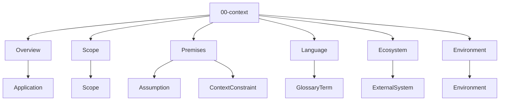
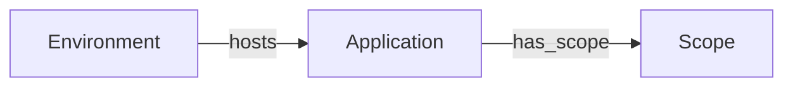

# Entity Map — 00-context

Derived from: [overview.md](overview.md), `docs/meta/01-entity-types/00-context/`, `docs/meta/03-rules/00-context/valid-triples.md`, [folder-structure.md](../folder-structure.md) § 00-context

## Câu hỏi

App tồn tại trong bối cảnh nào, phạm vi, premise, ngôn ngữ, ecosystem?

## Concern → Entity



| Concern | Entity types |
| --- | --- |
| Overview | Application |
| Scope | Scope |
| Premises | Assumption, ContextConstraint |
| Language | GlossaryTerm |
| Ecosystem | ExternalSystem |
| Environment | Environment |

## Graph quan hệ (meta)



| Source | Relation | Target |
| --- | --- | --- |
| Application | `has_scope` | Scope |
| Environment | `hosts` | Application |

Validate: `docs/meta/03-rules/00-context/valid-triples.md`.

## Cross-layer

```text
DomainConcept --specializes--> GlossaryTerm
```

Premise rộng (Assumption / ContextConstraint) không tự nối mọi entity — xem note trong cross-layer valid-triples.
