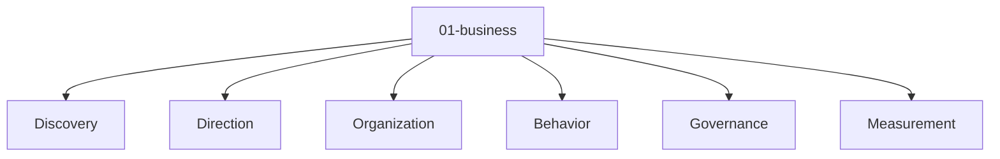

# Entity Map — 01-business

Derived from: [overview.md](overview.md), [folder-structure.md](../folder-structure.md) § 01-business

## Câu hỏi

Business cần gì và vận hành thế nào?

## Concern lens (pure/default)

Pure source: [universal 01-business pack](packs/universal/01-business/README.md).

Map này chỉ giữ concern lens. Entity type, relation slot và valid triple active thuộc `docs/meta/` của project.

## Status

Chưa có default canonical entity type set hoặc interaction graph trong guide cho layer này. Type/graph active thuộc `docs/meta/` của project.
