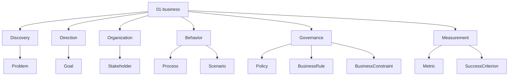
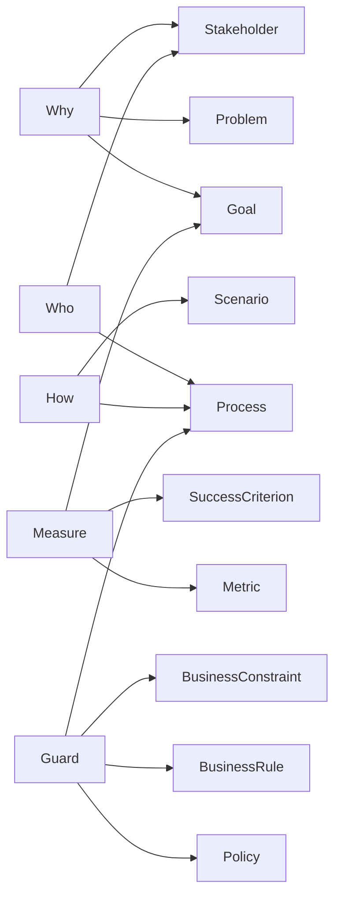
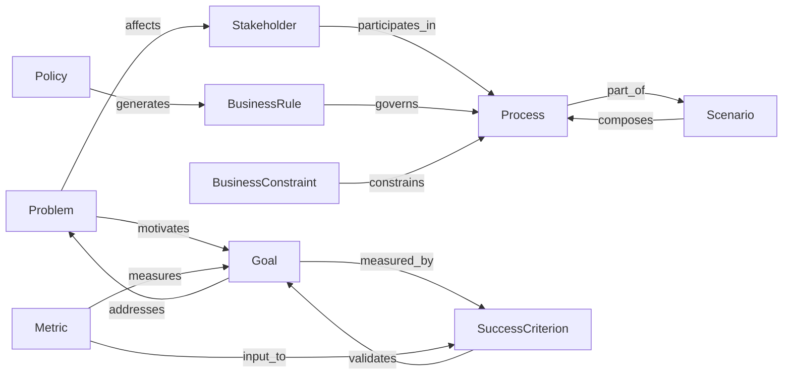

# Entity Map — 01-business

Derived from: [overview.md](overview.md), `docs/meta/01-entity-types/01-business/`, `docs/meta/03-rules/01-business/valid-triples.md`, [folder-structure.md](../folder-structure.md) § 01-business

## Câu hỏi

Business gặp vấn đề gì, muốn đạt gì, ai tham gia, vận hành và đo thế nào?

## Concern → Entity



| Concern | Entity types |
| --- | --- |
| Discovery | Problem |
| Direction | Goal |
| Organization | Stakeholder |
| Behavior | Process, Scenario |
| Governance | BusinessRule, Policy, BusinessConstraint |
| Measurement | Metric, SuccessCriterion |

## Lens phân tích



| Lens | Entity chính |
| --- | --- |
| Why | Problem, Goal, Stakeholder |
| Who | Stakeholder, Process |
| How | Scenario, Process |
| Guard | Policy, BusinessRule, BusinessConstraint, Process |
| Measure | Goal, Metric, SuccessCriterion |

## Graph quan hệ (meta)



| Source | Relation | Target |
| --- | --- | --- |
| Problem | `motivates` | Goal |
| Goal | `addresses` | Problem |
| Problem | `affects` | Stakeholder |
| Stakeholder | `participates_in` | Process |
| Scenario | `composes` | Process |
| Process | `part_of` | Scenario |
| Policy | `generates` | BusinessRule |
| BusinessRule | `governs` | Process |
| BusinessConstraint | `constrains` | Process |
| Goal | `measured_by` | SuccessCriterion |
| Metric | `measures` | Goal |
| Metric | `input_to` | SuccessCriterion |
| SuccessCriterion | `validates` | Goal |

Validate: `docs/meta/03-rules/01-business/valid-triples.md`.  
Dual còn mở (motivates/addresses, composes/part_of, …): `docs/review/review.md`.

## Cross-layer (điểm ra)

```text
BusinessRequirement --derived_from--> Problem
Persona --maps_from--> Stakeholder
Invariant --refined_from--> BusinessRule
```
