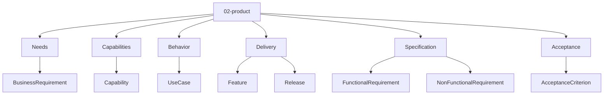
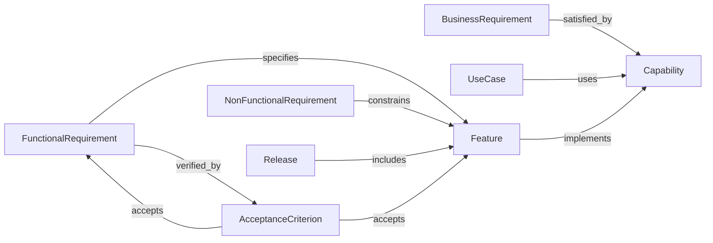
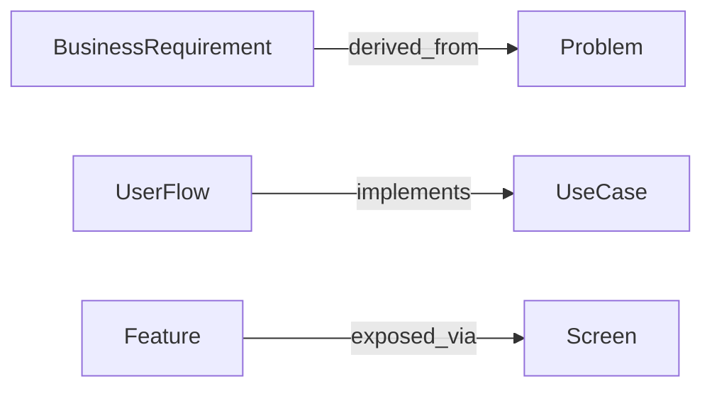

# Entity Map — 02-product

Derived from: [overview.md](overview.md), `docs/meta/01-entity-types/02-product/`, `docs/meta/03-rules/02-product/valid-triples.md`, [folder-structure.md](../folder-structure.md) § 02-product

## Câu hỏi

Product phải cung cấp gì để phục vụ business?

## Concern → Entity



| Concern | Entity types |
| --- | --- |
| Needs | BusinessRequirement |
| Capabilities | Capability |
| Behavior | UseCase |
| Delivery | Feature, Release |
| Specification | FunctionalRequirement, NonFunctionalRequirement |
| Acceptance | AcceptanceCriterion |

## Graph quan hệ (meta)



| Source | Relation | Target |
| --- | --- | --- |
| BusinessRequirement | `satisfied_by` | Capability |
| UseCase | `uses` | Capability |
| Feature | `implements` | Capability |
| FunctionalRequirement | `specifies` | Feature |
| NonFunctionalRequirement | `constrains` | Feature |
| Release | `includes` | Feature |
| FunctionalRequirement | `verified_by` | AcceptanceCriterion |
| AcceptanceCriterion | `accepts` | Feature |
| AcceptanceCriterion | `accepts` | FunctionalRequirement |

## Doctrine realization

```text
Feature --implements--> Capability
```

Không dual `Capability --delivered_by--> Feature`.  
Không dùng `UseCase --implemented_by--> Feature`.

Validate: `docs/meta/03-rules/02-product/valid-triples.md`.

## Cross-layer


