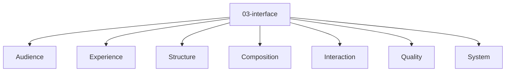

# Entity Map — 03-interface

Derived from: [overview.md](overview.md), [folder-structure.md](../folder-structure.md) § 03-interface

## Câu hỏi

Người dùng hoặc operator tương tác qua touchpoint nào?

## Concern lens (pure/default)

Pure source: [universal 03-interface pack](packs/universal/03-interface/README.md).

Map này chỉ giữ concern lens. Entity type, relation slot và valid triple active thuộc `docs/meta/` của project.
