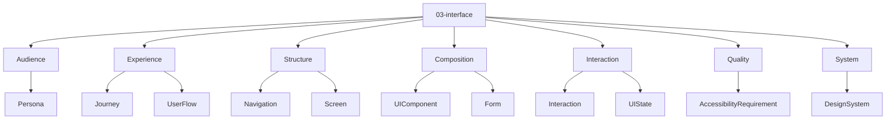
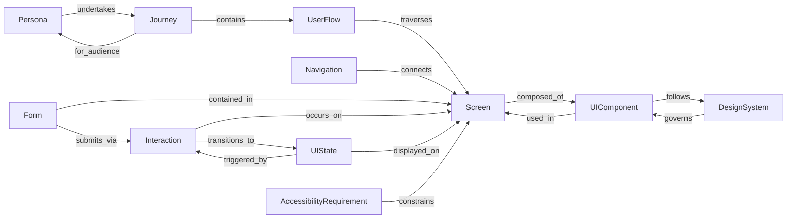
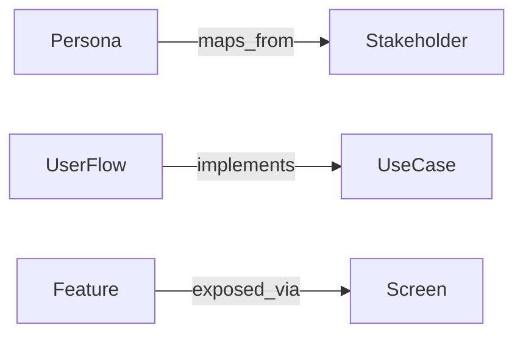

# Entity Map — 03-interface

Derived from: [overview.md](overview.md), `docs/meta/01-entity-types/03-interface/`, `docs/meta/03-rules/03-interface/valid-triples.md`, [folder-structure.md](../folder-structure.md) § 03-interface

## Câu hỏi

Người dùng hoặc operator chạm product qua touchpoint nào?

## Concern → Entity

| Concern | Entity types |
| --- | --- |
| Audience | Persona |
| Experience | Journey, UserFlow |
| Structure | Navigation, Screen |
| Composition | UIComponent, Form |
| Interaction | Interaction, UIState |
| Quality | AccessibilityRequirement |
| System | DesignSystem |

## Graph quan hệ (meta)

| Source | Relation | Target |
| --- | --- | --- |
| Persona | `undertakes` | Journey |
| Journey | `for_audience` | Persona |
| Journey | `contains` | UserFlow |
| UserFlow | `traverses` | Screen |
| Navigation | `connects` | Screen |
| Screen | `composed_of` | UIComponent |
| UIComponent | `used_in` | Screen |
| Form | `contained_in` | Screen |
| Form | `submits_via` | Interaction |
| Interaction | `occurs_on` | Screen |
| Interaction | `transitions_to` | UIState |
| UIState | `displayed_on` | Screen |
| UIState | `triggered_by` | Interaction |
| DesignSystem | `governs` | UIComponent |
| UIComponent | `follows` | DesignSystem |
| AccessibilityRequirement | `constrains` | Screen |

Validate: `docs/meta/03-rules/03-interface/valid-triples.md`.

## Cross-layer

