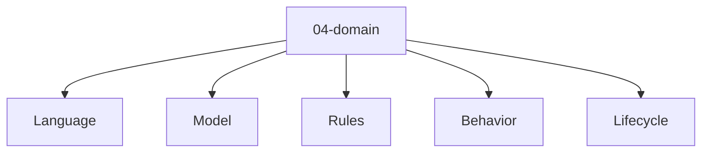

# Entity Map — 04-domain

Derived from: [overview.md](overview.md), [folder-structure.md](../folder-structure.md) § 04-domain

## Câu hỏi

Meaning, rule và lifecycle nội bộ của domain là gì?

## Concern lens (default)



Concern tree universal: [04-domain pack](packs/universal/04-domain/README.md).

## Variants

Default map chỉ giữ concern lens. Khi methodology thay đổi type/relation, đọc variant view tương ứng rồi route sang source pack:

| Variant | Map |
| --- | --- |
| DDD (tactical) | [variants/ddd/04-domain/](variants/ddd/04-domain/README.md) |

## Example

Template / định nghĩa type mẫu (không phải SoT của guide):

- [DDD 04-domain pack](packs/variants/ddd/04-domain/README.md)

## Cross-layer (điểm ra)

```text
DomainConcept --specializes--> GlossaryTerm
Invariant --refined_from--> BusinessRule
```
