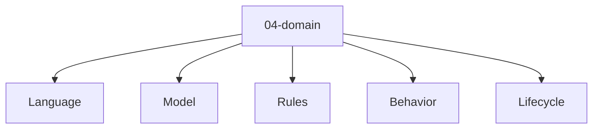

# Entity Map — 04-domain

Derived from: [overview.md](overview.md), [folder-structure.md](../folder-structure.md) § 04-domain

## Câu hỏi

Meaning/domain rule nội bộ là gì?

## Concern lens (pure/default)

Pure source: [universal 04-domain pack](packs/universal/04-domain/README.md).

Map này là concern lens thuần — không giả định DDD hay methodology khác. Type vocabulary phụ thuộc methodology thuộc variant pack; active contract thuộc `docs/meta/`.

## Variants (optional)

Chỉ đọc khi project đã chọn methodology làm đổi type/relation. Variant không thay pure/default map:

| Variant | Map |
| --- | --- |
| DDD (tactical) | [variants/ddd/04-domain/](variants/ddd/04-domain/README.md) |

Template reusable của DDD (nếu dùng): [packs/variants/ddd/04-domain/](packs/variants/ddd/04-domain/README.md).

## Status

Default map chỉ là concern lens. Type set/graph DDD nằm ở variant pack khi project chọn DDD; contract active thuộc `docs/meta/`.
