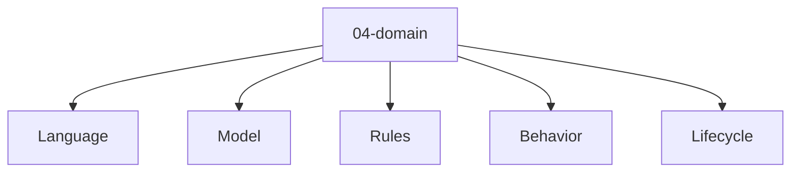

# Entity Map — 04-domain

Derived from: [overview.md](overview.md), [folder-structure.md](../folder-structure.md) § 04-domain

## Câu hỏi

Meaning, rule và lifecycle nội bộ của domain là gì?

## Concern lens (default)



| Concern | Ý nghĩa |
| --- | --- |
| Language | Khái niệm domain / ubiquitous language |
| Model | Model khái niệm |
| Rules | Invariant / policy domain |
| Behavior | Service / event có meaning domain |
| Lifecycle | State / lifecycle object |

## Variants

Default map chỉ giữ concern lens. Type pack + graph theo methodology → đọc variant tương ứng:

| Variant | Map |
| --- | --- |
| DDD (tactical) | [variants/ddd/04-domain/](variants/ddd/04-domain/README.md) |

## Example

Template / định nghĩa type mẫu (không phải SoT của guide):

- `docs/meta/01-entity-types/04-domain/`

## Cross-layer (điểm ra)

```text
DomainConcept --specializes--> GlossaryTerm
Invariant --refined_from--> BusinessRule
```
