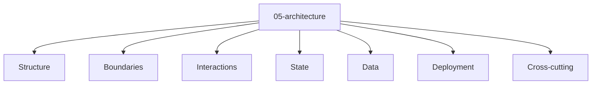

# Entity Map — 05-architecture

Derived from: [overview.md](overview.md), [folder-structure.md](../folder-structure.md) § 05-architecture

## Câu hỏi

Hệ thống được tổ chức bằng module, boundary, flow và state owner nào?

## Concern lens (default)

| Concern | Ý nghĩa |
| --- | --- |
| Structure | Module / component architecture |
| Boundaries | Ownership, public API, read/write rule |
| Interactions | Flow giữa modules/systems |
| State | State owner / lifecycle ở mức architecture |
| Data | Data flow / ownership giữa parts |
| Deployment | Deployment unit / topology |
| Cross-cutting | Rule áp dụng nhiều module |

## Variants

Default map chỉ giữ concern lens. Type pack + graph theo style → đọc variant tương ứng:

| Variant | Map |
| --- | --- |
| Modular monolith | [variants/modular-monolith/05-architecture/](variants/modular-monolith/05-architecture/README.md) |

## Example

Template / instance mẫu (không phải SoT của guide):

- `docs/app_variants/custom_modular_monolith/05-architecture/`
