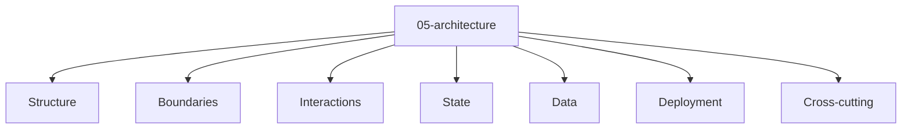

# Entity Map — 05-architecture

Derived from: [overview.md](overview.md), [folder-structure.md](../folder-structure.md) § 05-architecture

## Câu hỏi

System được tổ chức và boundary thế nào?

## Concern lens (pure/default)

Pure source: [universal 05-architecture pack](packs/universal/05-architecture/README.md).

Map này là concern lens thuần — không giả định monolith, modular monolith, microservices hay pattern khác. Project tự chọn entity type cụ thể trong từng concern; active contract và app truth nằm ở `docs/meta/` và `docs/app/`.

## Variants (optional)

Chỉ đọc khi project đã chọn style làm đổi type/relation. Variant không thay pure/default map:

| Variant | Map |
| --- | --- |
| Modular monolith | [variants/modular-monolith/05-architecture/](variants/modular-monolith/05-architecture/README.md) |

Template reusable của modular monolith (nếu dùng): [packs/variants/modular-monolith/05-architecture/](packs/variants/modular-monolith/05-architecture/README.md).
