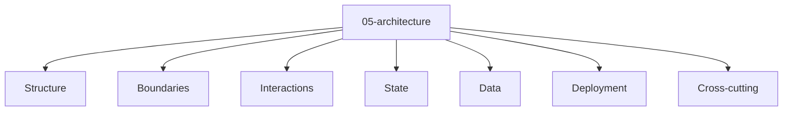

# Entity Map — 05-architecture

Derived from: [overview.md](overview.md), [folder-structure.md](../folder-structure.md) § 05-architecture

## Câu hỏi

Hệ thống được tổ chức bằng module, boundary, flow và state owner nào?

## Concern lens (default)

Concern tree universal: [05-architecture pack](packs/universal/05-architecture/README.md).

## Variants

Default map chỉ giữ concern lens. Khi style thay đổi type/relation, đọc variant view tương ứng rồi route sang source pack:

| Variant | Map |
| --- | --- |
| Modular monolith | [variants/modular-monolith/05-architecture/](variants/modular-monolith/05-architecture/README.md) |

## Source pack

Template reusable của modular monolith nằm ở [05-architecture guide pack](packs/variants/modular-monolith/05-architecture/README.md). Map này chỉ là concern lens mặc định; active contract và app-specific architecture truth vẫn nằm ở `docs/meta/` và `docs/app/` của project.
