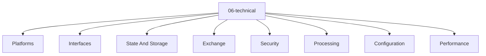

# Entity Map — 06-technical

Derived from: [overview.md](overview.md), [folder-structure.md](../folder-structure.md) § 06-technical

## Câu hỏi

Mechanism kỹ thuật nào được chọn?

## Concern lens (default)

Concern definition và boundary: [universal pack 06-technical](packs/universal/06-technical/README.md).

## Status

Chưa có default canonical entity type set hoặc interaction graph đã chốt cho layer này. File hiện là concern map; chỉ bổ sung stable map khi vocabulary type và canonical relation đã có reusable meaning rõ.

## Generic taxonomy

Taxonomy generic thuộc [universal pack 06-technical](packs/universal/06-technical/README.md), không phải canonical registry.
