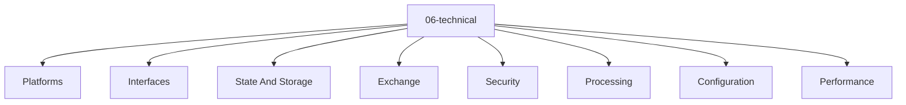

# Entity Map — 06-technical

Derived from: [overview.md](overview.md), [folder-structure.md](../folder-structure.md) § 06-technical

## Câu hỏi

Mechanism kỹ thuật nào được dùng (platform, store, API, config)?

## Concern lens (default)

| Concern | Ý nghĩa |
| --- | --- |
| Platforms | Runtime, framework, database, tool nền |
| Interfaces | API / protocol / schema contract |
| State And Storage | DB, cache, queue, file storage |
| Exchange | Communication / messaging mechanism |
| Security | Authn/z, secret, trust boundary kỹ thuật |
| Processing | Worker, job, pipeline mechanism |
| Configuration | Config set / feature flag mechanism |
| Performance | Caching, scaling, perf strategy |

## Status

Chưa có default canonical entity type set hoặc interaction graph đã chốt cho layer này. File hiện là concern map; bổ sung entity map khi vocabulary type và canonical relations được review/promote.

## Generic taxonomy

Taxonomy generic ở universal origin model (không phải canonical registry):

- [docs/app_variants/raw_app_original/06-technical/](../../../app_variants/raw_app_original/06-technical/README.md)
