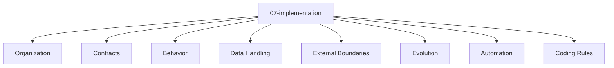

# Entity Map — 07-implementation

Derived from: [overview.md](overview.md), [folder-structure.md](../folder-structure.md) § 07-implementation

## Câu hỏi

Code/source tổ chức và implement mechanism thế nào?

## Concern lens (default)

| Concern | Ý nghĩa |
| --- | --- |
| Organization | Source layout, module folder, entrypoint |
| Contracts | Public API/interface ở code level |
| Behavior | Use case implementation / handler |
| Data Handling | Repository / query / mapping |
| External Boundaries | Client / adapter / webhook handler |
| Evolution | Migration / refactor / compatibility |
| Automation | Codegen / AI coding rule |
| Coding Rules | Import, style, review rule |

## Status

Hiện chưa có type pack hoặc interaction graph đã chốt cho `07-implementation`.

Nội dung implementation có thể phụ thuộc architecture style, nhưng dependency đó chưa đủ để gọi layer này là entity-map variant. Chỉ bổ sung variant khi đã review và chốt vocabulary type + graph riêng của layer.

## Example

Template / instance mẫu (không phải SoT của guide):

- `docs/app_variants/custom_modular_monolith/07-implementation/`
