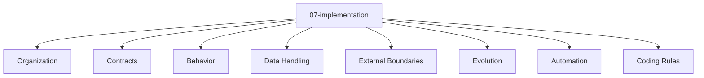

# Entity Map — 07-implementation

Derived from: [overview.md](overview.md), [folder-structure.md](../folder-structure.md) § 07-implementation

## Câu hỏi

Code/source tổ chức và implement mechanism thế nào?

## Concern lens (default)

Concern definition và boundary: [universal pack 07-implementation](packs/universal/07-implementation/README.md).

## Stable Source Boundary

Chưa có stable methodology-specific type pack, entity-map variant hoặc interaction graph cho `07-implementation`. Nội dung implementation có thể phụ thuộc architecture style, nhưng dependency đó chưa đủ để gọi layer này là entity-map variant.

Project tự quản lý implementation type và relation trong local `docs/meta/`/`docs/app/`. Chỉ thêm stable source pack khi vocabulary và graph đã có reusable meaning được review độc lập.
