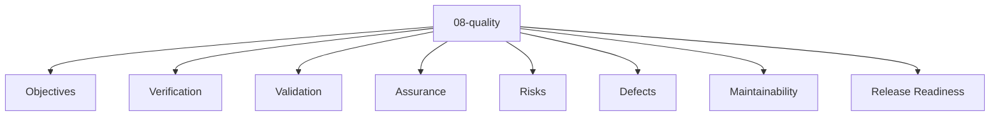

# Entity Map — 08-quality

Derived from: [overview.md](overview.md), [folder-structure.md](../folder-structure.md) § 08-quality

## Câu hỏi

Chất lượng được định nghĩa, kiểm tra và giữ bằng gì?

## Concern lens (default)

| Concern | Ý nghĩa |
| --- | --- |
| Objectives | Mục tiêu chất lượng |
| Verification | Kiểm chứng (test/verify) |
| Validation | Kiểm xác nhận (acceptance) |
| Assurance | Quy trình giữ chất lượng |
| Risks | Rủi ro chất lượng |
| Defects | Lỗi / defect tracking |
| Maintainability | Khả năng bảo trì |
| Release Readiness | Sẵn sàng release |

## Status

Chưa có default canonical entity type set hoặc interaction graph đã chốt cho layer này. File hiện là concern map; bổ sung entity map khi vocabulary type và canonical relations được review/promote.

## Generic taxonomy

Taxonomy generic ở universal origin model (không phải canonical registry):

- [docs/app_variants/raw_app_original/08-quality/](../../../app_variants/raw_app_original/08-quality/README.md)
