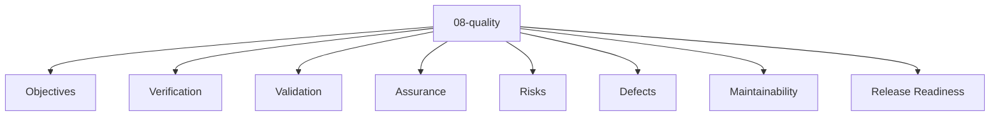

# Entity Map — 08-quality

Derived from: [overview.md](overview.md), [folder-structure.md](../folder-structure.md) § 08-quality

## Câu hỏi

Chất lượng được định nghĩa, kiểm tra và giữ bằng gì?

## Concern lens (default)

Concern definition và boundary: [universal pack 08-quality](packs/universal/08-quality/README.md).

## Status

Chưa có default canonical entity type set hoặc interaction graph đã chốt cho layer này. File hiện là concern map; chỉ bổ sung stable map khi vocabulary type và canonical relation đã có reusable meaning rõ.

## Generic taxonomy

Taxonomy generic thuộc [universal pack 08-quality](packs/universal/08-quality/README.md), không phải canonical registry.
