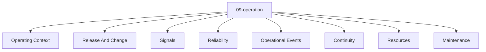

# Entity Map — 09-operation

Derived from: [overview.md](overview.md), [folder-structure.md](../folder-structure.md) § 09-operation

## Câu hỏi

Hệ thống chạy, quan sát, duy trì và phục hồi thế nào?

## Concern lens (default)

| Concern | Ý nghĩa |
| --- | --- |
| Operating Context | Môi trường / ngữ cảnh vận hành |
| Release And Change | Deploy / change window |
| Signals | Metrics, logs, traces |
| Reliability | SLO / error budget / resilience |
| Operational Events | Incident / alert |
| Continuity | Backup / recovery / DR |
| Resources | Capacity / cost / quota |
| Maintenance | Runbook / maintenance window |

## Status

Chưa có default canonical entity type set hoặc interaction graph đã chốt cho layer này. File hiện là concern map; bổ sung entity map khi vocabulary type và canonical relations được review/promote.

## Generic taxonomy

Taxonomy generic ở universal origin model (không phải canonical registry):

- [docs/app_variants/raw_app_original/09-operation/](../../../app_variants/raw_app_original/09-operation/README.md)
