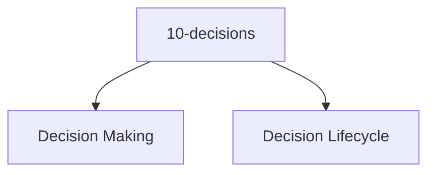

# Entity Map — 10-decisions

Derived from: [overview.md](overview.md), [folder-structure.md](../folder-structure.md) § 10-decisions

## Câu hỏi

Vì sao project chọn hướng này?

## Concern lens (default)

Concern tree universal: [10-decisions pack](packs/universal/10-decisions/README.md).

## Ghi chú

- Format/schema decision tái dùng được; nội dung decision luôn app-local.
- Layer này chưa có entity type set hoặc interaction graph; hiện là concern/decision mechanism map.
- Bổ sung entity map nếu và khi decision vocabulary được chốt thành entity registry.

## Example

Schema / unit template:

- `docs/meta/00-schemas/decision.md`
- `docs/guide/unit-structure/decision/`
