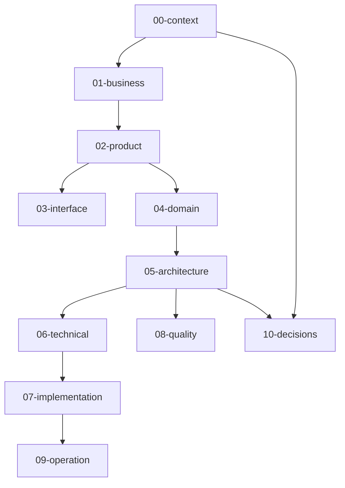
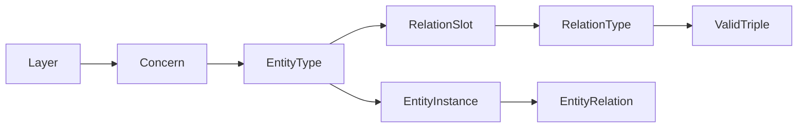

# Entity Analysis Map — Overview

File này là **bản đồ chung** để đọc entity types và quan hệ giữa các layer.

Nó không thay `docs/meta`. Nó cũng **không** mang vocabulary của một methodology/variant (DDD, modular-monolith, …). Cạnh hợp lệ lấy từ:

```text
docs/meta/01-entity-types/   → entity type + relations_template
docs/meta/02-relation-types/ → meaning + direction
docs/meta/03-rules/          → valid triples
```

Khi map này mâu thuẫn meta, ưu tiên meta.

Index folder: [README.md](README.md).

## Mục đích

- định hướng task thuộc layer/concern nào;
- chọn chiều fact gốc trước khi thêm relation;
- tránh mirror/dual cùng một fact;
- vào bằng pure/default map trước; chỉ mở variant khi methodology/style đã được chọn và làm đổi type/relation.

## Source, role và home

| Nguồn | Vai trò | Home |
| --- | --- | --- |
| Default layer map | Cửa vào pure theo layer: câu hỏi + concern lens | `entity-maps/NN-*.md` |
| Meta registry | Canonical entity type, relation type, valid triple active | `docs/meta/` |
| Universal origin model | Concern baseline và generic taxonomy tái dùng, không phụ thuộc methodology | [packs/universal/](packs/universal/README.md) |
| Variant map | Nhánh phụ khi type/relation phụ thuộc methodology/style; không thay default | [variants/](variants/) |
| Methodology pack | Vocabulary/template phụ thuộc methodology; chỉ dùng sau khi đã chọn style | [packs/variants/](packs/README.md) |

## Stack layer như lens phân tích



Thứ tự trên là **thứ tự đọc/hiểu**, không phải pipeline bắt buộc.

Bảng dưới chỉ liệt kê **pure/default map**. Câu hỏi lấy từ [layer-model.md](../../concepts/layer-model.md). Variant không nằm ở đây.

| Layer | Câu hỏi | Pure/default map |
| --- | --- | --- |
| `00-context` | App tồn tại trong bối cảnh nào? | [00-context.md](00-context.md) |
| `01-business` | Business cần gì và vận hành thế nào? | [01-business.md](01-business.md) |
| `02-product` | Product phải cung cấp gì? | [02-product.md](02-product.md) |
| `03-interface` | Người dùng hoặc operator tương tác qua touchpoint nào? | [03-interface.md](03-interface.md) |
| `04-domain` | Meaning/domain rule nội bộ là gì? | [04-domain.md](04-domain.md) |
| `05-architecture` | System được tổ chức và boundary thế nào? | [05-architecture.md](05-architecture.md) |
| `06-technical` | Mechanism kỹ thuật nào được chọn? | [06-technical.md](06-technical.md) |
| `07-implementation` | Code/source tổ chức và implement thế nào? | [07-implementation.md](07-implementation.md) |
| `08-quality` | Chất lượng được kiểm tra và giữ thế nào? | [08-quality.md](08-quality.md) |
| `09-operation` | Runtime/ops/recovery vận hành ra sao? | [09-operation.md](09-operation.md) |
| `10-decisions` | Vì sao project chọn hướng này? | [10-decisions.md](10-decisions.md) |

Chi tiết folder/concern: [folder-structure.md](../folder-structure.md).

## Mô hình knowledge unit



| Unit | Canonical home |
| --- | --- |
| Entity type | `docs/meta/01-entity-types/` |
| Relation type | `docs/meta/02-relation-types/` |
| Valid triple | `docs/meta/03-rules/` |
| Relation slot | `relations_template` trong entity type |
| Entity relation | YAML `relations:` trong instance `docs/app/**` |

Cheat sheet: [relation-cheatsheet.md](../relation-cheatsheet.md).

## Doctrine chiều fact (chung)

```text
1 fact = 1 canonical direction
```

- Không mirror cùng một fact ở hai README chỉ để đọc hai chiều.
- Reverse query mặc định: search / derived inverse / tooling.
- Chỉ tạo relation chiều kia khi **semantic độc lập** và có **query first-class** riêng.
- File relation type mới/sửa: `inverse: none` + `inverse kind: derived` trừ khi pair thật sự độc lập.

Chi tiết: [relation-model.md](../../concepts/relation-model.md).

## Cầu cross-layer

Cross-layer chỉ hợp lệ khi có valid triple trong `docs/meta/03-rules/` của project.

Overview **không** liệt kê type set hay triple của một methodology/variant. Triple cụ thể đọc meta; bridge phụ thuộc methodology đọc variant map tương ứng.

Rule:

1. Đọc pure/default map của layer trước (`NN-*.md` + universal concern).
2. Chỉ khi project đã chọn methodology/style cho layer đó → mở `variants/<name>/<layer>/`, rồi route sang source pack.
3. Cross-layer chỉ khi có valid triple trong meta.
4. Theory/Decision không đi qua relation graph; dùng `theory_basis` / `decision_basis`.

## Cách dùng trong task

```text
1. Xác định layer → mở entity-maps/NN-*.md (pure/default).
2. Chỉ mở variant nếu project đã chọn methodology/style làm đổi type/relation.
3. Kiểm tra slot + triple trong docs/meta trước khi thêm relation.
4. Chọn một chiều fact gốc; chiều ngược = derived trừ khi chứng minh độc lập.
```

Workflow: [read-for-task.md](../../workflows/read-for-task.md), [write-docs.md](../../workflows/write-docs.md), [trace-impact.md](../../workflows/trace-impact.md).

## Ngoài phạm vi overview

- Chi tiết lens từng layer → file `NN-*.md`.
- Vocabulary/graph methodology → `variants/<name>/<layer>/` và packs tương ứng.
- Instance app trong `docs/app`.
- Danh sách đầy đủ valid triple → `docs/meta`.
