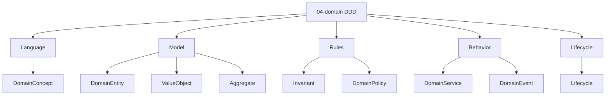

# Type View — DDD / 04-domain

Status: **reading view**. Source pack: [../../../packs/variants/ddd/04-domain/README.md](../../../packs/variants/ddd/04-domain/README.md), [folder-structure.md](../../../../folder-structure.md) § 04-domain

## Concern → Entity

Danh sách stable type template thuộc [DDD 04-domain base](../../../packs/variants/ddd/04-domain/README.md). `docs/meta/01-entity-types/04-domain/` giữ contract active của project.

Quan hệ: [interaction-map.md](interaction-map.md).
