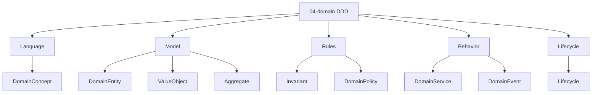

# Entity Types — DDD / 04-domain

Derived from: `docs/meta/01-entity-types/04-domain/`, [folder-structure.md](../../../../folder-structure.md) § 04-domain

## Concern → Entity

| Concern (04) | Entity types |
| --- | --- |
| Language | DomainConcept |
| Model | DomainEntity, ValueObject, Aggregate |
| Rules | Invariant, DomainPolicy |
| Behavior | DomainService, DomainEvent |
| Lifecycle | Lifecycle |

Định nghĩa: `docs/meta/01-entity-types/04-domain/` (khi materialize theo pack này).

Quan hệ: [interaction-map.md](interaction-map.md).
