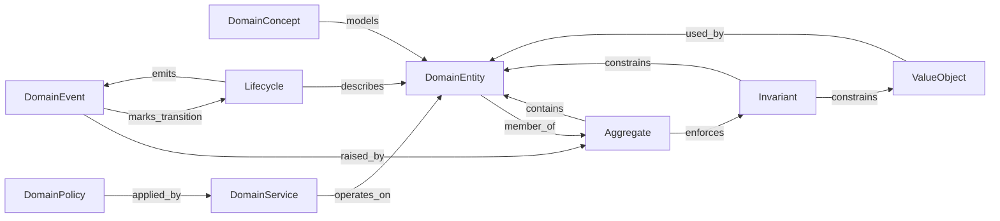

# Interaction Map — DDD / 04-domain

Reading view cho relation template DDD tactical ở layer `04-domain`. Source rules: [DDD valid triples](../../../packs/variants/ddd/04-domain/valid-triples.md).

## Graph

## Ghi chú

- Pack khác (không DDD) = variant khác; không sửa map này thành “mọi domain”.
- Dual `contains` / `member_of` có thể còn mở — `docs/review/review.md`.
- Triple list canonical thuộc [DDD valid triples](../../../packs/variants/ddd/04-domain/valid-triples.md).
