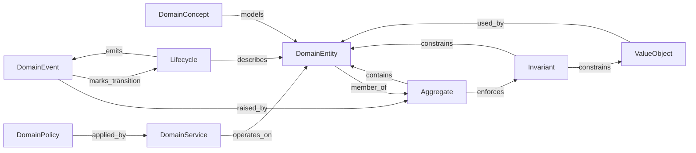

# Interaction Map — DDD / 04-domain

Quan hệ **trong** pack DDD tactical ở layer `04-domain`. Derived from (khi có): `docs/meta/03-rules/04-domain/valid-triples.md`.

## Graph

## Triple list

| Source | Relation | Target |
| --- | --- | --- |
| DomainConcept | `models` | DomainEntity |
| DomainEntity | `member_of` | Aggregate |
| Aggregate | `contains` | DomainEntity |
| ValueObject | `used_by` | DomainEntity |
| Aggregate | `enforces` | Invariant |
| Invariant | `constrains` | DomainEntity |
| Invariant | `constrains` | ValueObject |
| DomainPolicy | `applied_by` | DomainService |
| DomainService | `operates_on` | DomainEntity |
| DomainEvent | `raised_by` | Aggregate |
| DomainEvent | `marks_transition` | Lifecycle |
| Lifecycle | `describes` | DomainEntity |
| Lifecycle | `emits` | DomainEvent |

## Ghi chú

- Pack khác (không DDD) = variant khác; không sửa map này thành “mọi domain”.
- Dual `contains` / `member_of` có thể còn mở — `docs/review/review.md`.
